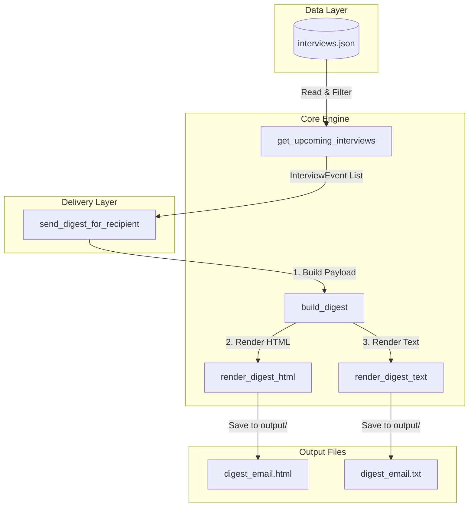

# Digest Notifications

<p align="left">
  
  
  
  
  
</p>

An automated, lightweight batching module designed to reduce notification fatigue by summarizing upcoming interview events into a single daily or weekly email digest instead of sending multiple separate notification emails.

---

## 💡 What the Project Does

This project provides an automated backend engine and an interactive web control room to solve notification fatigue in recruitment workflows. It performs the following operations:

1. **Gathers & Filters Data**: Reads mock scheduled interviews from a JSON database (`data/interviews.json`) and filters for upcoming events (on or after a selected reference date).
2. **Batch Capping**: Enforces a strict batch size limit (default: **5 interviews**) to keep digest emails concise and readable.
3. **Chronological Grouping**: Groups the upcoming interviews under calendar date headers and sorts them chronologically by time within each day.
4. **Dual-Format Compilation**: Compiles the grouped interviews into a premium, responsive **HTML email layout** (via Jinja2) and a clean **plain-text fallback** layout (improving email deliverability scores).
5. **Interactive Web Dashboard**: Spawns a local HTTP server hosting a dark-mode dashboard where recruiters can:
   - Schedule new mock interviews or delete existing ones.
   - Select daily or weekly schedules and reference dates.
   - Instantly render and preview HTML and plain-text outputs.
   - Log dispatches to a audit log database (`data/sent_logs.json`).

---

## 📐 Architecture Flow



---

## 📁 Project Structure

```
Digest-Notifications/
├── .gitignore                      # Git control exclusions
├── README.md                       # Comprehensive documentation
├── requirements.txt                # External dependencies (Jinja2)
├── data/
│   ├── interviews.json             # Database storing upcoming mock interviews
│   └── sent_logs.json              # History log of dispatched digests
├── output/
│   ├── digest_email.html           # Generated HTML email body
│   └── digest_email.txt            # Generated plain-text fallback body
├── src/
│   ├── digest.py                   # CLI controller & HTTP REST APIs
│   ├── models.py                   # Plain data models (InterviewEvent, DigestRecipient, etc.)
│   ├── digest_builder.py           # Chronological date-bucketing logic
│   ├── renderer.py                 # Jinja2 HTML & plain-text compilation
│   ├── sender.py                   # Provider-agnostic batch dispatch interfaces
│   ├── templates/
│   │   └── digest_template.html    # Premium responsive HTML email template
│   └── web/
│       ├── index.html              # Web Dashboard HTML
│       └── main.js                 # Web Dashboard JS
└── tests/
    └── test_digest_notifications.py # Consolidated unit & integration test suite (10 tests)
```

---

## 🚀 Getting Started

### 1. Prerequisites
Ensure you have **Python 3.8+** installed.

### 2. Installation
Install the required dependency (Jinja2):
```bash
pip install -r requirements.txt
```

### 3. Run the Test Suite
Execute the consolidated verification tests:
```bash
python tests/test_digest_notifications.py
```

### 4. Run the Web Dashboard Control Panel
To open the interactive dashboard control room:
```bash
python src/digest.py --serve --port 8000
```
Then navigate to **http://localhost:8000** in your browser.

---

## 💻 CLI Usage

Use the command line interface to trigger digest generation manually or in a cron job:

```bash
# Generate a Daily digest (default)
python src/digest.py --cli --type daily

# Generate a Weekly digest starting from a specific reference date
python src/digest.py --cli --type weekly --ref-date 2026-06-27
```

**CLI Output (JSON stdout):**
```json
{
  "status": "success",
  "digest_type": "daily",
  "reference_date": "2026-06-27",
  "date_range": "June 27, 2026",
  "interviews_count": 5,
  "batch_size_limit": 5,
  "output_html": "output/digest_email.html",
  "output_text": "output/digest_email.txt"
}
```

---

## 🔌 Developer Integration Guide

This module is designed to plug cleanly into larger codebases.

### 1. Programmatic Compilation
To compile a digest programmatically in your services:

```python
import datetime
from models import DigestRecipient, InterviewEvent, DigestFrequency
from digest_builder import build_digest
from renderer import render_digest_html, render_digest_text

# 1. Define recipient
recipient = DigestRecipient(
    user_id="user-456",
    email="recipient@example.com",
    display_name="Sarah Connor",
    frequency=DigestFrequency.DAILY
)

# 2. Package events
interviews = [
    InterviewEvent(
        interview_id="int-101",
        candidate_name="Alex Rivera",
        role_title="Backend Engineer",
        interviewer_name="Thomas Anderson",
        scheduled_at=datetime.datetime(2026, 7, 1, 10, 0)
    )
]

# 3. Compile assets
payload = build_digest(recipient, interviews)
unsubscribe_url = "https://example.com/unsubscribe?user_id=user-456"

html_body = render_digest_html(payload, unsubscribe_url=unsubscribe_url)
text_fallback = render_digest_text(payload, unsubscribe_url=unsubscribe_url)
```

### 2. Custom Email Provider (SES / SendGrid)
To send digests via a real provider, implement the `EmailSenderProtocol` interface:

```python
from sender import EmailSenderProtocol, send_digest_for_recipient

class MySendGridAdapter(EmailSenderProtocol):
    def send_html_email(self, to_email: str, subject: str, html_body: str) -> dict:
        # Plug in your SendGrid client library code here
        return {"status": "sent", "provider": "sendgrid"}

# Dispatch
result = send_digest_for_recipient(
    recipient=recipient,
    interviews=interviews,
    email_sender=MySendGridAdapter(),
    unsubscribe_base_url="https://example.com"
)
```

---

*Made with ❤️ by [Dhanish Ladwani](https://github.com/dhanish0711)*
